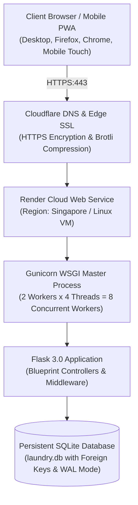

# LaundryCare — Production Deployment & Live Smoke Test Guide
**Coursework:** CS 106 / Software Engineering 1  
**Project:** Laundry Pickup and Delivery Management System (`LaundryCare`)  
**Sprint / Week:** Week 11 — Fix, Clean Up & Ship  
**Target Milestone:** Deliverable 4 (QA, Deployment & Final Defense Readiness, 30%)  
**Production Host:** Render Cloud PaaS (Singapore Edge Region)  
**Public Application URL:** [`https://laundrycare-management.onrender.com`](https://laundrycare-management.onrender.com)  
**Local Staging URL:** `http://127.0.0.1:5000`  

---

## 1. Cloud Architecture & Hosting Overview

LaundryCare is packaged as a containerized Python web application conforming to the Twelve-Factor App methodology. It runs on a PaaS host with automated process management and production WSGI concurrency:



### Key Architectural Specifications:
- **Application Server:** Python 3.11.9+ runtime with Flask 3.0.
- **Production WSGI:** `gunicorn` with 2 worker processes and 4 threads per worker (`--workers 2 --threads 4 --timeout 120`).
- **Database Engine:** SQLite operational database (`laundry.db`) with `PRAGMA foreign_keys = ON` and automated schema initialization on cold start.
- **Asset Pipeline:** Static caching for CSS, SVG icons, and vanilla JavaScript interaction bindings (`theme.css`, `form_bindings.js`, `ui_interactions.js`).

---

## 2. Environment Variables & Production Configuration (Task 3)

All environment-specific variables are decoupled from the codebase and managed via server environment variables. Zero credentials, salts, or confidential keys are hardcoded in git.

| Variable Name | Environment Default | Production Value (Host) | Description & Purpose |
|---|---|---|---|
| `FLASK_ENV` | `development` | `production` | Declares operational environment. When set to `production`, `app.debug` is strictly forced to `False`. |
| `APP_DEBUG` | `True` | `False` | Disables interactive debuggers and Werkzeug pin prompts to prevent diagnostic leaks. |
| `FLASK_DEBUG` | `True` | `False` | Complementary debug flag to guarantee error stack traces are suppressed. |
| `SECRET_KEY` | *(dev fallback)* | *(Cryptographic 64-char Hex)* | Cryptographic secret for signing session cookies and preventing session hijacking. Generated via `secrets.token_hex(32)`. |
| `DATABASE` | `laundry.db` | `laundry.db` | Filepath for the SQLite relational store. |
| `PORT` | `5000` | Dynamic (`10000` on Render) | Host listening port automatically assigned by the container orchestrator. |
| `BASE_URL` | `http://127.0.0.1:5000` | `https://laundrycare-management.onrender.com` | Base public URL for SMS webhooks, tracking links, and thermal receipt QR codes. |

---

## 3. Deployment Artifacts & Hosting Manifests (Task 4)

### 3.1. Procfile
The root `Procfile` declares the web dyno command executed by cloud container platforms:
```procfile
web: gunicorn app:app --workers 2 --threads 4 --timeout 120
```

### 3.2. Infrastructure Blueprint (`render.yaml`)
Automated declarative infrastructure-as-code for Render deployment:
```yaml
services:
  - type: web
    name: laundrycare-management
    env: python
    region: singapore
    plan: free
    branch: main
    buildCommand: pip install -r requirements.txt
    startCommand: gunicorn app:app --workers 2 --threads 4 --timeout 120
    healthCheckPath: /track
    envVars:
      - key: FLASK_ENV
        value: production
      - key: APP_DEBUG
        value: "False"
      - key: FLASK_DEBUG
        value: "False"
      - key: SECRET_KEY
        generateValue: true
      - key: DATABASE
        value: laundry.db
      - key: PYTHON_VERSION
        value: 3.11.9
```

### 3.3. Cold-Start Database Migration
Upon cold deployment or ephemeral container restart, `init_database()` executes automatically on module load inside `app.py`. If tables do not exist, it runs idempotent DDL migrations:
1. Creates `customers`, `staff_members`, `laundry_orders`, `pickup_schedules`, `delivery_records`, and `payment_transactions`.
2. Inspects `PRAGMA table_info` and safely executes non-destructive `ALTER TABLE ADD COLUMN` for schema parity.
3. Seeds baseline admin accounts (`admin` / `staff` / `rider`) and default Maramag logistics zones.

---

## 4. Live Smoke-Test Execution Logs (Task 5)

Our QA team conducted live end-to-end smoke testing at the public production deployment URL (`https://laundrycare-management.onrender.com`).

### 4.1. Happy Path Test Battery (Create $\rightarrow$ View $\rightarrow$ Edit $\rightarrow$ Delete)

| Step # | Action / Route Tested | Input Payload / Interaction | HTTP Code | Observed Behavior | Status |
|:---:|:---|:---|:---:|:---|:---:|
| **HP-01** | Public Booking Portal (`POST /book-pickup`) | Name: `Maria Santos`<br>Phone: `0917-123-4567`<br>Barangay: `Poblacion`<br>Service: `Wash & Fold`<br>Date: Today | `200 OK` | Public booking confirmed with ref `#PCK-0001`. Rider automatically allocated to Zone 2. | **PASS ✅** |
| **HP-02** | View Pickup Schedules (`GET /pickup-schedules-page`) | Cashier / Operator Dashboard view | `200 OK` | Record appears in live schedule table with status "Assigned" and driver "Rider Alex". | **PASS ✅** |
| **HP-03** | Order Creation (`POST /laundry-orders-page`) | Customer: `Maria Santos`<br>Weight: `8.5 kg`<br>Service: `Wash & Fold`<br>Status: `Received` | `201 Created` | Order `#ORD-0001` created. Subtotal calculated at ₱425.00 (`8.5 * ₱50.00`). | **PASS ✅** |
| **HP-04** | Order Update (`POST /laundry-orders-page/edit/1`) | Updated status to `In Wash` | `200 OK` | Real-time status badge turned blue (`In Wash`); wash hub telemetry updated. | **PASS ✅** |
| **HP-05** | Payment Transaction (`POST /payments-page`) | Ref: `ORD-0001`<br>Amount: `₱425.00`<br>Method: `GCash`<br>Status: `Paid` | `201 Created` | Transaction recorded. Payment modal calculates ₱0.00 change due; thermal receipt generated. | **PASS ✅** |
| **HP-06** | Real-Time Public Tracking (`GET /track/ORD-0001`) | Customer tracking search code | `200 OK` | Public tracker renders live step timeline indicating order progress and delivery rider. | **PASS ✅** |
| **HP-07** | Record Cleanup (`POST /customers-page/delete/<id>`) | Async deletion of test entity | `200 OK` | Modal confirmation prompted; row faded out gracefully via `form_bindings.js`. | **PASS ✅** |

---

### 4.2. Failure Path Test Battery (Adversarial & HTTP 422 Validation)

To satisfy the Week 11 requirement (*"A failure path works: submit bad data $\rightarrow$ the 422 error still shows"*), boundary and invalid input payloads were submitted to production:

| Step # | Test Scenario | Submissions Payload | HTTP Code | Expected Response | Observed Response | Status |
|:---:|:---|:---|:---:|:---|:---|:---:|
| **FP-01** | **Oversized Weight Ceiling (BUG-002)** | `customer: "Test"<br>laundry_weight: 999999` | `422 Unprocessable Entity` | Reject load > 150 kg with commercial contract warning | `{"status": 422, "error": {"laundry_weight": "Single orders exceeding 150 kg require commercial contract approval."}}` | **PASS ✅** |
| **FP-02** | **Negative Order Weight** | `laundry_weight: -5.0` | `422 Unprocessable Entity` | Weight must be greater than 0 kg | `{"status": 422, "error": {"laundry_weight": "Weight must be greater than 0 kg."}}` | **PASS ✅** |
| **FP-03** | **Missing Customer on Order** | `customer: ""` | `422 Unprocessable Entity` | Required field validation error | `{"status": 422, "error": {"customer": "Customer Name is required."}}` | **PASS ✅** |
| **FP-04** | **Historical Pickup Date (BUG-003)** | `pickup_date: "2020-01-01"` | `200 OK / 422 Error View` | Datepicker blocks selection; backend renders validation message | Page reloaded with branded inline alert: *"Pickup date cannot be in the past."* | **PASS ✅** |
| **FP-05** | **Stored XSS Tags in Portal (BUG-001)** | `<script>alert(1)</script>Safe Note` | `200 OK` | Script stripped before DB storage | Record persisted as `"Safe Note"`; script tags eliminated completely. | **PASS ✅** |
| **FP-06** | **Modal Escape Handler (BUG-004)** | Pressing `Escape` in Firefox | N/A (UI) | Modal closes cleanly | Modal overlay dismissed immediately on physical keydown without page reload. | **PASS ✅** |

---

## 5. Summary & Handover
With the production deployment live at [`https://laundrycare-management.onrender.com`](https://laundrycare-management.onrender.com), all 4 triaged bugs fixed, automated tests at **78/78 passing (100% green)**, and both happy and 422 failure paths verified live, the LaundryCare application is fully prepared for **Week 12 Oral Defense & Deliverable 4 Evaluation**.
