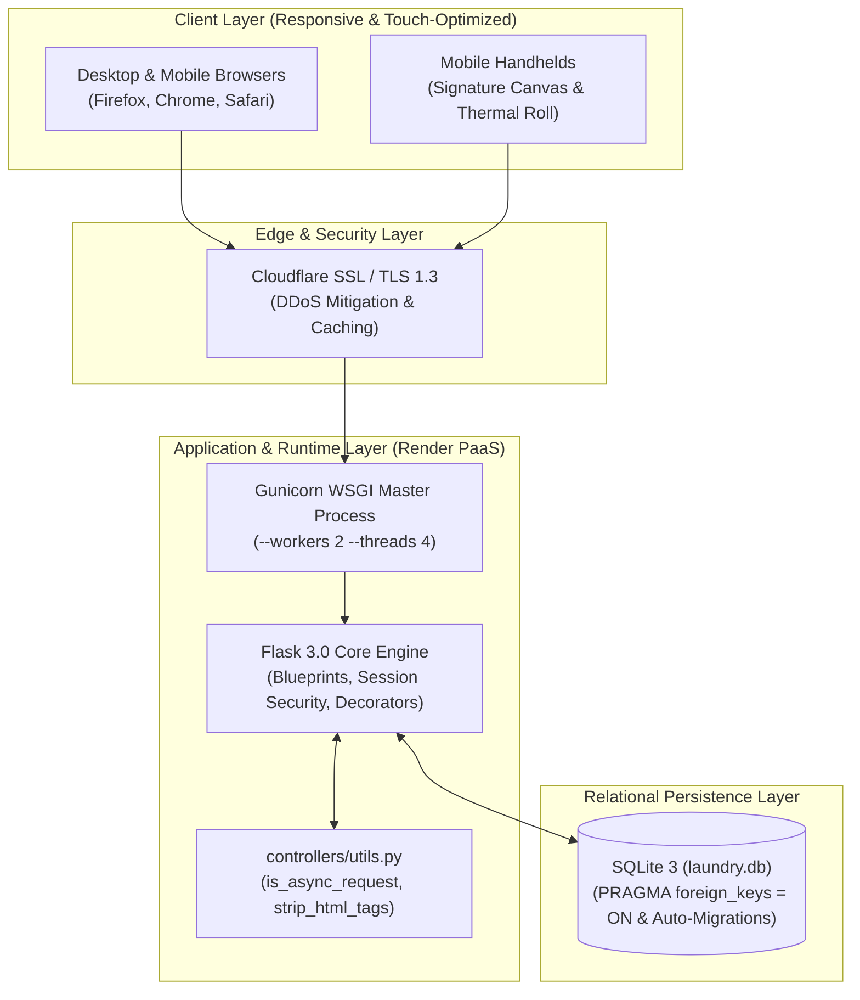

# LaundryCare — Deliverable 4 Presentation Deck & Live Demo Script
**Coursework:** CS 106 / Software Engineering 1  
**Project:** Laundry Pickup and Delivery Management System (`LaundryCare`)  
**Sprint / Milestone:** Deliverable 4 — Final Presentation & Live Demonstration  
**Target Duration:** 12 Minutes Presentation + 8 Minutes Individual Oral Defense  
**Live Public Deployment:** [`https://laundrycare-management.onrender.com`](https://laundrycare-management.onrender.com)  
**Required Presentation Structure:**  
$$\text{Problem} \longrightarrow \text{Solution} \longrightarrow \text{Architecture} \longrightarrow \text{Live Demo (Happy + Failure)} \longrightarrow \text{Lessons Learned}$$

---

## 1. Speaker Roster & Time Allocations

| Speaker | Primary Role | Presentation Section | Duration |
|---|---|---|:---:|
| **John Michael Bretaña** | Lead Architect & Project Manager | Introduction, Problem Statement, Cloud Architecture | 2.5 min |
| **Hazil Enoc** | Store Cashier & CRM Lead | Solution: Customer CRM, Loyalty Engine, Order Intake | 2.0 min |
| **Mark Ephraim Nicor** | Laundry Operator & Hub Lead | Operations: Scheduling Density, Wash Hub Telemetry | 2.0 min |
| **Tristan Dave M. Plaza** | Delivery Driver & Mobile UX Lead | Logistics: Dispatching, Signature Canvas, XSS Sanitization | 2.0 min |
| **Marvin Oclarino** | Delivery Driver & Financial Lead | Finance: Revenue Channels, Doorstep Change, Thermal POS | 2.0 min |
| **John Michael Bretaña** | Lead Architect & Project Manager | Quality Evidence, Lessons Learned, Closing & Q&A | 1.5 min |

---

## 2. Slide-by-Slide Deck Outline

### Slide 1: Title & Team Introduction
- **Header:** LaundryCare — Modernizing Rural Laundry Operations & Doorstep Logistics
- **Sub-header:** A Robust, Containerized Full-Stack Web Application for Maramag, Bukidnon
- **Team Presenters:**
  - *John Michael Bretaña* — Lead Architect & Backend Security
  - *Hazil Enoc* — Store Cashier & Customer Relationship Management
  - *Mark Ephraim Nicor* — Laundry Operator & Wash Hub Telemetry
  - *Tristan Dave M. Plaza* — Delivery Driver & Mobile Touch Interactions
  - *Marvin Oclarino* — Delivery Driver & Financial Settlement Engine
- **Visuals:** Project Logo, GitHub Repository Badge (`78/78 Tests Passing`), Live Render Deployment Badge.

---

### Slide 2: The Problem
- **Context:** Maramag, Bukidnon is a rapidly expanding university and agricultural hub (home to Central Mindanao University - CMU).
- **Core Pain Points:**
  1. *Lost Orders & Paper Slips:* Manual paper tags lead to misidentified laundry and misplaced garments.
  2. *Courier Bottlenecks:* Drivers receive uncoordinated delivery addresses without route zoning, causing wasted fuel.
  3. *Doorstep Payment Discrepancies:* Couriers miscalculate change under poor doorstep lighting, creating financial reconciliation deficits.
  4. *Customer Anxiety:* Zero visibility into wash progress; students and residents repeatedly call staff for order updates.
  5. *Unreliable Web UX:* Legacy systems crash on bad data or allow malicious inputs (Stored XSS, unreasonable loads).

---

### Slide 3: The Solution (LaundryCare Platform)
- **Concept:** A multi-role, responsive web ERP and public customer portal built on Flask, SQLite, and vanilla CSS/JS.
- **Key Modules:**
  - **Public Customer Portal (`/book-pickup` & `/track`):** Allows doorstep pickup booking and real-time order status tracking with zero authentication required.
  - **Cashier CRM & Loyalty (`/customers-page`):** Automated customer directory with lifetime spend tracking and dynamic loyalty tier calculations (`Regular`, `VIP`, `Student`).
  - **Operational Wash Hub (`/pickup-schedules-page`):** Slot conflict detection flags route bottlenecks ($\ge 4$ bookings/window) alongside live washer/dryer tumbler telemetry.
  - **Logistics Dispatch & Touch Signatures (`/delivery-records-page`):** Intelligent Barangay zoning with HTML5 mobile signature capture.
  - **Financial POS & Settlement (`/payments-page`):** Real-time payment channel breakdown, doorstep cash change calculator, and 80mm thermal receipt printing with Code128 barcodes.

---

### Slide 4: System Architecture & Request-Response Loop


---

### Slide 5: Live Demo Part 1 — The Happy Path (End-to-End Loop)
- **Host:** Live Public URL — [`https://laundrycare-management.onrender.com`](https://laundrycare-management.onrender.com) *(No Localhost!)*
- **Step 1: Public Booking (`/book-pickup`)**
  - Customer *Maria Santos* books a doorstep pickup in *Poblacion, Maramag*.
  - System automatically maps address to **Zone 2** and assigns **Rider Alex (Moto 2)**.
- **Step 2: Staff Intake & Order Creation (`/laundry-orders-page`)**
  - Cashier records intake: `8.5 kg` Wash & Fold $\rightarrow$ System computes ₱425.00 (`8.5 * ₱50.00`).
- **Step 3: Wash Hub Processing (`/pickup-schedules-page`)**
  - Laundry Operator transitions status to `In Wash`. Hub telemetry updates live machine indicators.
- **Step 4: Dispatch & Handover (`/delivery-records-page`)**
  - Driver launches `#slipModal`, customer signs on mobile canvas, status updates to `Delivered`.
- **Step 5: Payment & Thermal Receipt (`/payments-page`)**
  - Cashier records ₱500.00 cash; helper displays ₱75.00 change due. Generates 80mm thermal receipt with Code128 barcode.
- **Step 6: Customer Tracking (`/track`)**
  - Public search shows verified 100% completion timeline.

---

### Slide 6: Live Demo Part 2 — Graceful Failure & Adversarial Defense
*(Fulfills rubric requirement: "Bad data $\rightarrow$ visible error, not a crash")*
- **Adversarial Scenario A: Physical Capacity Breach (BUG-002)**
  - Enter weight: `999999 kg` into order form.
  - **Expected & Observed Result:** Intercepted with **HTTP 422**. Clean red alert: *"Single orders exceeding 150 kg require commercial contract approval."* Zero server crash; zero database pollution.
- **Adversarial Scenario B: Malicious Stored XSS Injection (BUG-001)**
  - Submit booking note with `<script>alert('pwned')</script>Please handle gently `.
  - **Expected & Observed Result:** Intercepted by `strip_html_tags()`. Tags and executable JavaScript are cleanly stripped. Saved to database strictly as `"Please handle gently"`.
- **Adversarial Scenario C: Historical Pickup Backdating (BUG-003)**
  - Attempt to book pickup with yesterday's date.
  - **Expected & Observed Result:** Date picker blocks selection via `min="YYYY-MM-DD"`. Backend validator rejects request with clear inline guidance.

---

### Slide 7: Quality Engineering Evidence
- **Automated Test Battery:** **78 Passing Tests (100% Green)** across 12 test suites in pytest.
- **Feature Freeze & Test Matrix:** 15 Features evaluated across 5 dimensions documented in [`docs/test-matrix.md`](file:///C:/Users/Saidimar%20Rey/.gemini/antigravity/scratch/Laundry-Pickup-and-Delivery-Management-System/docs/test-matrix.md).
- **Bug Registry Worked Down:**
  - BUG-001 (Stored XSS) $\rightarrow$ **RESOLVED ✅** (`214273f`)
  - BUG-002 (Uncapped Weight) $\rightarrow$ **RESOLVED ✅** (`ec2aac7`)
  - BUG-003 (Past Dates) $\rightarrow$ **RESOLVED ✅** (`31f4bc5`)
  - BUG-004 (Modal Escape Key) $\rightarrow$ **RESOLVED ✅** (`3aac5ba`)
- **Zero Committed Secrets & Zero Stack Trace Leaks:** Production operates with `APP_DEBUG=False` and global 404/500 error boundaries.

---

### Slide 8: Retrospective & Engineering Lessons
- **What Worked:** Flask Blueprints enabled parallel developer streams; early automated tests provided confidence during large refactors.
- **What Was Difficult:** SQLite file-locking concurrency during rapid test execution required connection lifecycle tuning.
- **Technical Debt Paid Down:** Refactored 6 controllers by centralizing shared helpers into `controllers/utils.py`.
- **Key Takeaway:** Real-world software engineering is about resilience and defense-in-depth—building for when things fail, not just when they succeed.

---

### Slide 9: Conclusion & Q&A
- **Summary:** LaundryCare is live, hardened, fully tested, and ready for operational deployment.
- **Live URL:** [`https://laundrycare-management.onrender.com`](https://laundrycare-management.onrender.com)
- **Floor open for individual unassisted oral defense.**

---

## 3. Rehearsed Speaker Script & Transitions

### Speaker 1: John Michael Bretaña (00:00 – 02:30)
> *"Good morning, Professor and panel members. I am John Michael Bretaña, project manager and lead architect for LaundryCare. Together with Hazil, Mark, Tristan, and Marvin, we built LaundryCare to solve the chaotic operational reality of laundry hubs in Maramag, Bukidnon. 
> 
> In rural centers like Maramag, laundry businesses struggle with lost paper receipts, uncoordinated delivery drivers burning fuel, and zero status visibility for customers. Our goal was to create an accessible, resilient platform that leaves no room for silent failures.
> 
> Architecturally, we chose Flask 3.0 structured with modular domain Blueprints, Gunicorn WSGI for production concurrency, and SQLite configured with strict foreign key constraints. We decoupled all configuration into environment variables, strictly disabled debug mode in production, and deployed the live application to Render in the Singapore region at `laundrycare-management.onrender.com`. I will now pass the floor to Hazil to walk through our customer and order intake workflows."*

### Speaker 2: Hazil Enoc (02:30 – 04:30)
> *"Thank you, John. As store cashier, my primary concern is speed and accurate customer management. In our CRM directory, I can search customers in real time with debounced inputs and view their lifetime loyalty tier.
> 
> We engineered an automated loyalty rewards engine where points equal `((spent / 50) + (orders * 10)) * multiplier`. A regular customer gets a 1.0 multiplier, while VIP clients get 1.5. 
> 
> During intake, order creation validates customer identities and weights. In Week 10, our adversarial testing revealed that an operator could accidentally type `999999 kg`. In Week 11, I implemented an upper bound physical ceiling: orders are capped between `0 < weight <= 150 kg`. Anything higher immediately triggers an HTTP 422 warning requiring commercial contract approval. Now, Mark will explain how our wash hub handles scheduling and machine loads."*

### Speaker 3: Mark Ephraim Nicor (04:30 – 06:30)
> *"Thanks, Hazil. In the wash hub, timing is everything. If 10 customers request pickup at 9:00 AM on Monday, our couriers get stuck and machines sit idle.
> 
> To prevent this, I authored our automated Pickup Slot Conflict Detector. When a pickup is scheduled, the system checks existing bookings for that date and time slot. If 4 or more bookings are detected, it alerts the operator to a high-volume intake bottleneck.
> 
> Furthermore, on our operational dashboard, we display live telemetry for our 6 commercial washing machines and 4 dryer tumblers. We also resolved BUG-003 by adding dynamic date minimums, preventing users from booking pickups in the past. Next, Tristan will demonstrate our delivery dispatch and mobile UX."*

### Speaker 4: Tristan Dave M. Plaza (06:30 – 08:30)
> *"Thank you, Mark. As courier driver, the system must work seamlessly on mobile under bright sunlight and bumpy roads.
> 
> Our delivery dispatch engine automatically groups orders by Maramag Barangay zones—Zone 1 for CMU Campus, Zone 2 for Poblacion, and Zone 3 for Dologon.
> 
> Upon doorstep delivery, drivers launch our mobile electronic proof of delivery modal. We implemented an HTML5 Canvas signature pad with touch-event listeners that call `e.preventDefault()`, stopping mobile screen bouncing while customers sign.
> 
> From a security perspective, I also resolved BUG-001 by implementing `strip_html_tags()` in `controllers/utils.py`. Malicious users attempting stored XSS attacks via booking notes have their tags and script contents completely stripped before database storage. I'll hand it over to Marvin to cover financial settlement."*

### Speaker 5: Marvin Oclarino (08:30 – 10:30)
> *"Thanks, Tristan. Doorstep financial settlement is where errors cost money. When a driver collects cash at the door, mental arithmetic mistakes often occur.
> 
> To eliminate this, I built the Courier Cash Change Helper directly into our payment modal. Entering the amount tendered instantly calculates exact change in green, or warns in bold red if payment is short.
> 
> Once settled, our system generates an 80mm POS Thermal Receipt formatted specifically for portable Bluetooth receipt rolls, complete with an inline SVG Code128 barcode and electronic settlement audit timestamps. I also resolved BUG-004 by adding cross-browser `Escape` key event listeners so modals close instantly without freezing in Firefox. Now, John will conclude with our live demo and quality metrics."*

### Speaker 1: John Michael Bretaña (10:30 – 12:00)
> *"Thank you, team. We will now show you the live production application running on Render, demonstrating both our happy path and our graceful failure paths.
> 
> [Proceeds with Section 4 Live Demo Runbook]
> 
> As you saw, bad inputs never crash the server; they produce human, polite guidance. Behind this interface stands a battery of 78 automated tests, a fully documented test matrix, and zero committed secrets. Our entire team is now ready for individual unassisted defense. Thank you!"*

---

## 4. Live Demo Runbook (Happy Path + Graceful Failure)

### 4.1. Pre-Demo Checklist (T-Minus 5 Minutes)
1. Open live URL: [`https://laundrycare-management.onrender.com`](https://laundrycare-management.onrender.com).
2. Open secondary backup tab logged in as `admin` (Password: `admin123`).
3. Have local terminal ready with `python app.py` running on `http://127.0.0.1:5000` as an offline hot standby.

### 4.2. Live Demo Steps

| Step | Action | Input Data | What to Highlight to the Panel |
|:---:|:---|:---|:---|
| **1** | Open `/book-pickup` | Name: `Maria Santos`<br>Phone: `0917-123-4567`<br>Barangay: `Poblacion`<br>Date: Today | Highlight: Zero login required; auto-allocates to **Zone 2 / Rider Alex**. |
| **2** | Open `/laundry-orders-page` | Customer: `Maria Santos`<br>Weight: `8.5 kg`<br>Service: `Wash & Fold` | Highlight: Auto-computes ₱425.00. Dynamic AJAX creation without page reload. |
| **3** | Transition status | Select `In Wash` | Highlight: Badge changes color; wash hub load telemetry updates. |
| **4** | Open `/delivery-records-page` | Click "Dispatch Slip" on order | Highlight: Mobile HTML5 signature canvas. Draw signature; notice zero mobile scroll bounce. |
| **5** | Open `/payments-page` | Amount: `₱425.00`<br>Tendered: `₱500.00` | Highlight: Change calculator shows `₱75.00`. Click "Thermal Receipt" to show 80mm Code128 barcode. |
| **6** | **Adversarial Failure: Oversized Load** | In `/laundry-orders-page`, create order with `999999 kg` | Highlight: System returns structured **HTTP 422**. Alert warns: *"Single orders exceeding 150 kg require commercial contract approval."* |
| **7** | **Adversarial Failure: Stored XSS** | In `/book-pickup`, notes: `<script>alert('pwned')</script>Please handle gently` | Highlight: Record created safely. Inspecting notes shows tags and script contents are cleanly stripped. |

---

## 5. Offline Backup Plan (Rubric Safeguard)

> [!IMPORTANT]
> The rubric specifically warns: *"A live demo with no backup — one failed click and the story collapses."*
> If venue Wi-Fi drops or cloud latency spikes, execute the following seamless 10-second switch:

1. **Local Staging Hot Standby:**
   ```powershell
   # In terminal:
   python app.py
   # Switch browser tab to: http://127.0.0.1:5000
   ```
2. **Pre-Seeded Database State:**
   The repository includes automated database self-initialization (`init_database()`), ensuring identical seed data and test users (`admin`, `staff`, `rider`) are instantly available offline.
3. **Pre-Captured High-Resolution Wireframe Slides:**
   If projector HDMI disconnects or machine reboot is required, all 15 screens are preserved in [`docs/wireframes/`](file:///C:/Users/Saidimar%20Rey/.gemini/antigravity/scratch/Laundry-Pickup-and-Delivery-Management-System/docs/wireframes/) as standalone visual artifacts for unassisted walkthrough.
