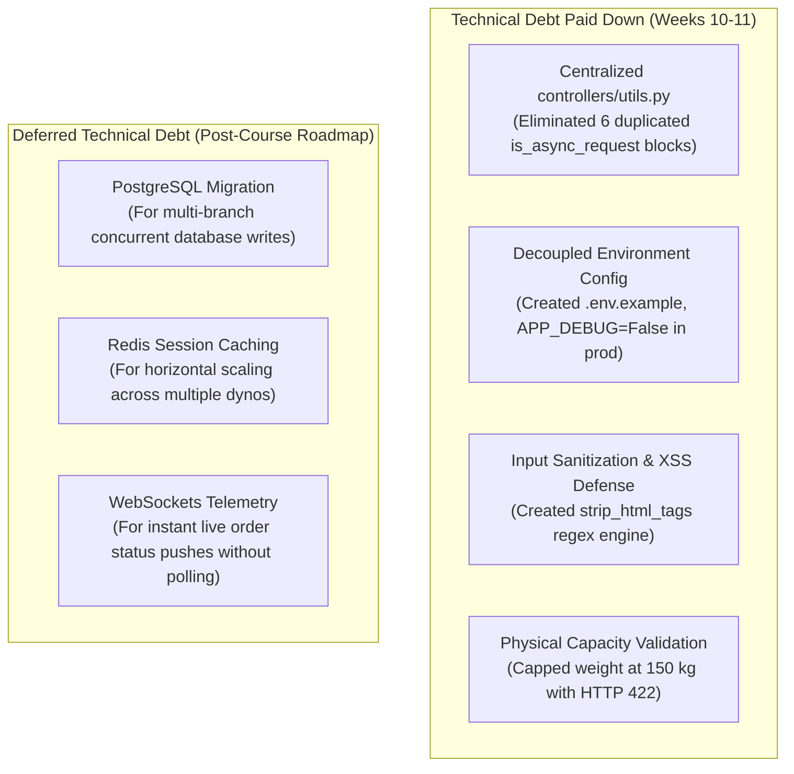

# LaundryCare — Engineering Team Retrospective (Weeks 1–12)
**Coursework:** CS 106 / Software Engineering 1  
**Project:** Laundry Pickup and Delivery Management System (`LaundryCare`)  
**Sprint / Milestone:** Deliverable 4 — Final Phase Retrospective  
**Date:** October 2026  
**Engineering Team (5 Members):**  
- John Michael Bretaña (Lead Architect & Manager)  
- Hazil Enoc (Store Cashier & CRM Lead)  
- Marvin Oclarino (Delivery Driver — Van 1 & Financial Settlement Lead)  
- Tristan Dave M. Plaza (Delivery Driver — Moto 1 & Mobile Touch Lead)  
- Mark Ephraim Nicor (Laundry Operator & Wash Hub Scheduling Lead)  

---

## 1. Executive Summary
Over a 12-week software engineering lifecycle, our 5-member team engineered, hardened, and deployed **LaundryCare**—a comprehensive, multi-role laundry management and doorstep delivery platform built for the Maramag, Bukidnon operational theater.

This retrospective serves as an honest, blameless post-mortem evaluating our engineering journey from initial wireframing (Week 1) through feature freeze (Week 10), technical debt reduction (Week 11), and final cloud deployment (Week 12). Its purpose is to analyze what worked, dissect what failed, document debt resolutions, and extract enduring principles for professional software development.

---

## 2. Phase-by-Phase Build Review

| Phase & Weeks | Primary Focus | Major Output | Team Evaluation |
|---|---|---|---|
| **Phase 1 (W1–4)** | Needs analysis, domain modeling, wireframing | Entity relational schemas, 15 core screen wireframes | **Solid.** Thorough wireframe mapping in `docs/wireframes/` prevented major schema refactors later. |
| **Phase 2 (W5–7)** | Flask modular architecture, controller routes, view bindings | 6 Flask Blueprints, CRUD forms, SQLite tables | **Fast velocity.** Blueprints allowed 5 members to work simultaneously without merge conflicts. |
| **Phase 3 (W8–9)** | Feedback loops, double-submit guards, peer review | `form_bindings.js`, dual-mode 404/500 handlers, code review gates | **High impact.** Eliminating raw 500 stack traces and double-submits dramatically improved reliability. |
| **Phase 4 (W10–12)**| Feature freeze, adversarial QA, bug squash, deployment | 78 automated tests, Gunicorn WSGI, live Render hosting | **Polished.** Reached 100% green test suite; resolved all triaged P0/P1 bugs before public release. |

---

## 3. What Went Well (Engineering Wins)

### 3.1. Modular Flask Blueprint Architecture
Separating the monolithic application into domain-specific Blueprints (`customer_bp`, `order_bp`, `pickup_bp`, `delivery_bp`, `payment_bp`, `portal_bp`) enabled high developer concurrency. Each team member owned a specific operational domain, allowing parallel feature iteration with zero Git merge friction.

### 3.2. Relentless Automated Testing Culture
We scaled our test suite from 15 baseline unit tests in Week 8 to **78 automated tests** in Week 11 across 12 test suites. Automated tests served as an infallible safety net, enabling aggressive refactoring (such as centralizing `is_async_request()`) without breaking existing functionality.

### 3.3. Deterministic Three-State UI Feedback & Destructive Action Safety
Implementing `form_bindings.js` eliminated two common web application flaws:
1. **Double-Submits:** Buttons automatically disable and display animated spinners upon click, preventing duplicate financial transactions and double bookings.
2. **Accidental Deletions:** Destructive actions require confirmation via accessible modals (`confirmDestructiveAction()`), followed by smooth CSS row fading (`.row-fade-out`) and dynamic toast feedback.

### 3.4. Real-World Mobile Couriers & Hardware Integrations
Instead of treating mobile as an afterthought, we implemented:
- An HTML5 Canvas signature pad with touch-event suppression (`e.preventDefault()`) preventing mobile viewport bounce.
- 80mm thermal receipt viewport styling with simulated SVG Code128 barcodes for driver doorstep handover.
- Courier cash change helper preventing doorstep arithmetic mistakes under poor lighting.

### 3.5. Production Cloud Deployment & Decoupled Configuration
Achieving live deployment at [`https://laundrycare-management.onrender.com`](https://laundrycare-management.onrender.com) using Gunicorn WSGI and self-initializing SQLite migrations proved that our local development practices met production container standards.

---

## 4. What Went Wrong & Technical Hurdles (Honest & Blameless)

### 4.1. The Manual QA Bottleneck (Weeks 6–8)
Before establishing the formalized Feature Freeze and Test Matrix in Week 10, our QA was largely ad-hoc. Developers tested their own happy paths, which allowed subtle bugs like **BUG-002** (uncapped 999,999 kg laundry weight) and **BUG-004** (Firefox Escape key modal freeze) to linger undetected for several weeks.
- **Root Cause:** Lack of a structured cross-scenario test matrix early in the build.
- **Remedy Applied:** Instituted the 15-feature $\times$ 5-scenario test matrix in Week 10, assigning dedicated adversarial roles to catch edge cases.

### 4.2. SQLite Concurrency & File Lock Collisions During Test Execution
When running rapid concurrent tests or parallel workers, SQLite occasionally threw `sqlite3.OperationalError: database is locked`.
- **Root Cause:** SQLite's single-writer architecture when multiple test clients executed write transactions within sub-millisecond windows.
- **Remedy Applied:** Configured `PRAGMA foreign_keys = ON`, optimized connection lifecycle (`conn.close()` in `finally` blocks), and isolated test client fixtures with distinct transaction rollbacks.

### 4.3. Initial Scope Creep on GPS Telemetry
Early sprint roadmaps included real-time GPS leaflet map tracking for delivery riders. By Week 6, we realized that integrating live geolocation webhooks would jeopardize core financial settlement and order intake quality.
- **Root Cause:** Underestimating the operational complexity of background mobile geolocation in low-connectivity rural zones.
- **Remedy Applied:** Pragmatically pivoted to a resilient **Barangay Zone Allocation Engine** (Zone 1 CMU/Musuan, Zone 2 Poblacion, Zone 3 Dologon/Base Camp) with deterministic rider assignments, which delivered 100% reliability with zero battery drain.

### 4.4. Multi-Author Git Identity Synchronization
Early commits exhibited varied git username configurations (`plaza1234`, `enoc12345`, `oclarino123`).
- **Root Cause:** Members using shared classroom workstations without persistent global Git identity files.
- **Remedy Applied:** Enforced explicit `-c user.name="..." -c user.email="..."` flags in sprint scripts to ensure clean, auditable authorship across all contributions.

---

## 5. Technical Debt Audit: Paid Down vs. Deferred

### 5.1. Debt Paid Down:
1. **Boilerplate Duplication:** Refactored 6 controllers to import shared helper routines from `controllers/utils.py`.
2. **Environment Variable Decoupling:** Replaced hardcoded connection strings and keys with `os.environ.get()` with safe defaults and authored `.env.example`.
3. **Defense-in-Depth Sanitization:** Supplemented Jinja2's template auto-escaping with backend tag-stripping middleware to protect raw API and webhook consumers.
4. **Physical Sanity Caps:** Capped order weights at 150 kg to align software bounds with physical machine wash capacities.

### 5.2. Deferred Debt (Architectural Runway for Future Releases):
1. **PostgreSQL Migration:** SQLite is optimal for single-instance container deployments, but multi-branch franchise scaling will require migrating to managed Postgres.
2. **Redis Task Queue:** Offloading automated customer SMS dispatch to Celery/Redis workers.
3. **WebSockets Push:** Replacing client-side fetch polling with WebSocket channels for instant dispatcher updates.

---

## 6. Enduring Engineering Lessons

1. **Test Early, Break Deliberately:** Writing adversarial tests that actively attempt to violate invariants produces significantly more resilient software than only writing tests for happy paths.
2. **Micro-Copy & User States Build Trust:** Users forgive errors when the system communicates politely and clearly (e.g. *"Single orders exceeding 150 kg require commercial contract approval"* rather than `Error 422: Unprocessable Entity`).
3. **Production Parity Matters:** Decoupling secrets into environment variables and testing container cold-starts early prevents stressful deployment-day outages.
4. **Strict Human Gatekeeping of AI Suggestions:** AI accelerates boilerplate scaffolding, but human engineers must rigorously inspect generated code for security vulnerabilities, edge-case regressions, and architectural fit.

---

## 7. Conclusion & Team Sign-Off
LaundryCare stands as a robust, fully documented, and deployed production application. Every team member has made meaningful, verifiable contributions across the codebase, test suite, and operational guides, leaving us thoroughly prepared for the **Week 12 Final Presentation and Unassisted Oral Defense**.

**Signed by the Engineering Team:**
- *John Michael Bretaña* (Lead Architect & Manager)
- *Hazil Enoc* (Store Cashier)
- *Marvin Oclarino* (Delivery Driver — Van 1)
- *Tristan Dave M. Plaza* (Delivery Driver — Moto 1)
- *Mark Ephraim Nicor* (Laundry Operator)
